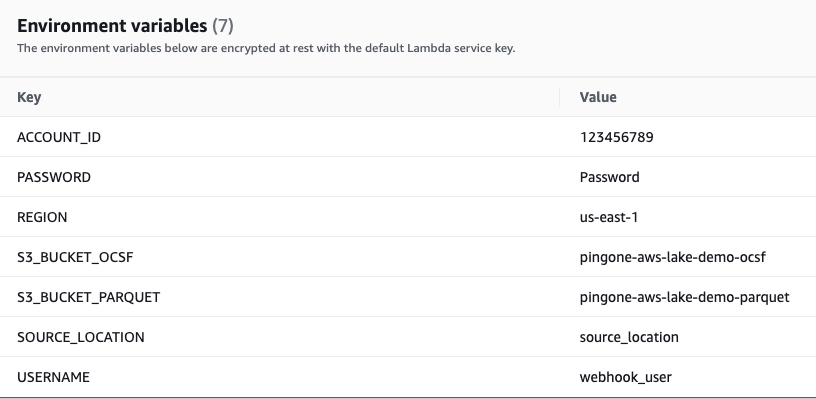
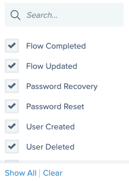
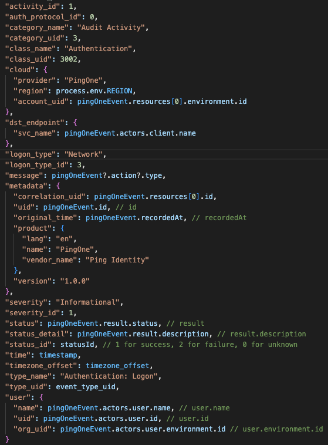
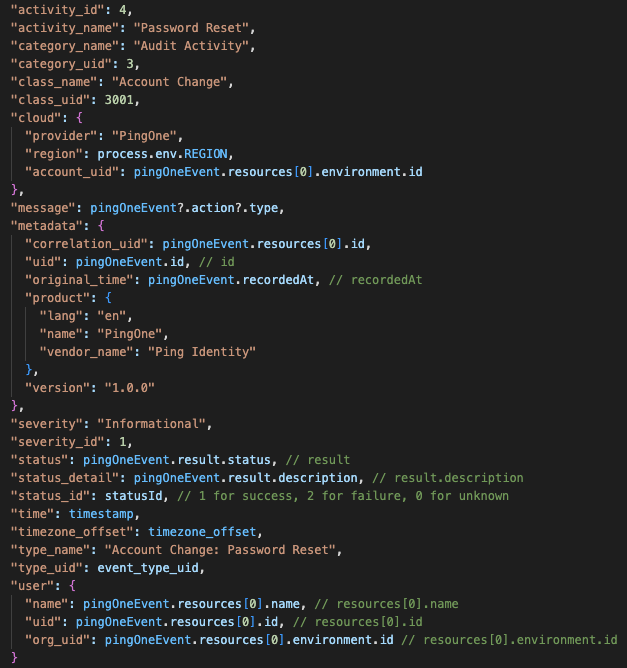
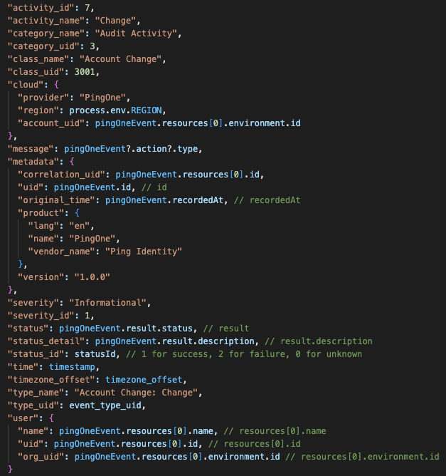

# PingOne Integration to AWS Security Lake

## Enable PingOne event log integration to AWS Security Lake

### AWS Security Lake Overview
AWS Security Lake is a data lake for security logs, built in the customer’s account. The data lake is backed by an S3 bucket, and organizes data as a set of AWS Lake Formation tables. AWS Security Lake is designed to optimize the cost of storing and querying massive security log sources, while maintaining good query performance and compatibility with a wide variety of analytic infrastructure. AWS Security Lake
customers retain low-level ownership of their data. AWS Security Lake also delivers a set of core AWS-native security logs, minimizing costs and maximizing performance.

### Open Cybersecurity Schema Framework (OCSF)
Core to the AWS Security Lake mission is simplifying the storage, retrieval, and consumption of security logs through application of a common schema. The Open Cybersecurity Schema Framework (OCSF) is a collaborative open-source effort between AWS and partners. OCSF includes syntax and semantics for common security log events, defines versioning criteria to facilitate schema evolution, and includes a self-governance process to be maximally inclusive of security log producers and consumers. OCSF source code is homed on Github, and is released under the Apache License version 2.0.

## Requirements
* PingOne Tenant
* AWS Lambda Function using index.js from [https://github.com/pingone-davinci/pingone-aws-lake]
* AWS S3 (Two Buckets) 

## Before you begin
* In AWS:
  * Create two S3 buckets to store the OCSF events, for example:
    * Temporary (JSON): pingone-aws-lake-demo-ocsf
    * Output (Parquet): pingone-aws-lake-demo-parquet
  * Create new AWS Lambda function
    * Select Node.js 16.x as the runtime
    * Configure the runtime to have 512MB of memory and 1 minute timeout
    * Download the index.js and package.json from https://github.com/pingone-davinci/pingone-aws-lake and create a zip deployment package as per the AWS Lambda documentation here (https://docs.aws.amazon.com/lambda/latest/dg/nodejs-package.html)

## Steps

### Configure AWS Lambda Environment Variables

1. Create the following required Environment Variable under Lambda > Functions > Configuration > Environment Variables with the following details:

| Environment Variable | Value |
| ----------- | ----------- |
| **ACCOUNT_ID**      | The AWS Account associated with PingOne events       |
| **PASSWORD**   | The PingOne Webhook basic authentication password        |
| **REGION**   |  The AWS Region of the Lambda   |
| **S3_BUCKET_OCSF**   |  The name of the S3 bucket created to store the temporary OCSF events      |
| **S3_BUCKET_PARQUET**   | The name of the S3 bucket created to store the final parquet event files        |
| **SOURCE_LOCATION**   | Is the location provided by AWS Security Lake when registering the custom source       |
| **USERNAME**   | The PingOne Webhook basic authentication username        |

2. Create a Function URL under Lambda > Functions > Configuration > Function URL with the following details:
    - **Auth type**: NONE

3. Configure PingOne Webhooks

4. Create a Webhook from Connections > Webhooks with the following details: 
    - **Name**: Ping Lake Webhook
    - **Destination URL**: Your AWS Lambda Function URL
       - For example: https://kgymdwz52ijsjjrh2u2fck2ksq0yosxg.lambda-url.us-east-1.on.aws/
    - **Format**: Ping Activity Format (JSON)
    - **Headers**: Basic Authentication 
       - Enter the username and password selected above in the AWS Lambda configuration

   - **Event Types**: 
      - Flow Completed
      - Flow Updated
      - Password Recovery
      - Password Reset
      - User Created
      - User Deleted
      - User Updated

5. Finally, click Save. 

### Summary

After the configuration has been completed, PingOne authentication, password resets, user create, update and deletes events will be created in Parquet format in the S3 bucket configured in the AWS Lambda.  

### Appendix:

#### PingOne to OCSF Mapping

##### Authentication Activity

##### Password Reset / Recovery

##### User Create

##### User Update

##### User Delete

