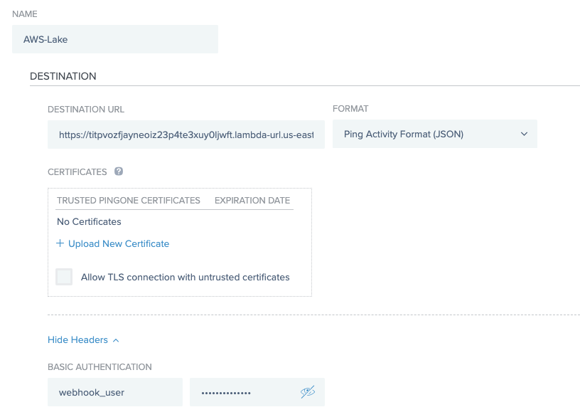

# PingOne Integration to Amazon Security Lake

### Amazon Security Lake Overview
Amazon Security Lake automatically centralizes security data from cloud, on-premises, and custom sources into a purpose-built data lake stored in your account. With Security Lake, you can get a more complete understanding of your security data across your entire organization. You can also improve the protection of your workloads, applications, and data. Security Lake has adopted the Open Cybersecurity Schema Framework (OCSF), an open standard. With OCSF support, the service can normalize and combine security data from AWS and a broad range of enterprise security data sources.


### Open Cybersecurity Schema Framework (OCSF)
Core to the Amazon Security Lake mission is simplifying the storage, retrieval, and consumption of security logs through application of a common schema. The Open Cybersecurity Schema Framework (OCSF) is a collaborative open-source effort between AWS and partners. OCSF includes syntax and semantics for common security log events, defines versioning criteria to facilitate schema evolution, and includes a self-governance process to be maximally inclusive of security log producers and consumers. OCSF source code is homed on Github, and is released under the Apache License version 2.0.


### PingOne Audit events to Amazon Security Lake

PingOne Audit events can be converted to OCSF events and Parquet format using the AWS Lambda Node.JS script available here: [https://github.com/pingone-davinci/pingone-amazon-security-lake]

The diagram below illustrates the process of converting the PingOne Audit events to OCSF events and to Parquet format for Amazon Security Lake:


## Requirements
* PingOne Tenant
* Amazon Security Lake 
* Two AWS accounts:
  * One to execute the AWS Lambda function, known below as **Lambda AWS Account**
  * One for Amazon Security Lake, known below as **Security Lake AWS Account**
* AWS Lambda Function using index.js from [https://github.com/pingone-davinci/pingone-amazon-security-lake]
* Two S3 buckets must be used.  The first S3 bucket is for the OCSF events which must exist in the **Lambda AWS Account** and the other is the Custom Source S3 bucket for Amazon Security Lake in the **Security Lake AWS Account**.

## Before you begin
* From the AWS Console using the **Lambda AWS Account**:
  * Create one S3 bucket to store the OCSF event, for example:
    * Temporary (JSON): pingone-aws-lake-demo-ocsf  
  * Create a new AWS Lambda function
    * Create an IAM role with access to the S3 bucket created above.
    * Select Node.js 16.x as the runtime
    * Configure the runtime to have 512MB of memory and 1 minute timeout
    * Download the index.js and package.json from https://github.com/pingone-davinci/pingone-amazon-security-lake and create a zip deployment package as per the AWS Lambda documentation here (https://docs.aws.amazon.com/lambda/latest/dg/nodejs-package.html)
    
* From the AWS Console using the **Security Lake AWS Account**:
  * Create a Custom Source within Security Lake for the PingOne Parquet files as per the following guide: https://docs.aws.amazon.com/security-lake/latest/userguide/custom-sources.html
  * For the S3 bucket associated with the Custom Source, create an IAM Role and grant Assume Role permission to the **Lambda AWS Account** using a policy as such as: 


```
{
    "Version": "2012-10-17",
    "Statement": [
        {

            "Sid": "1",
            "Effect": "Allow",
            "Principal": {
                "AWS": "arn:aws:iam::<Lambda AWS Account ID>:root" t
            },
            "Action": "sts:AssumeRole"
        }
    ]
}
```

This will allow the AWS Lambda in the **Lambda AWS Account** to write files to the Custom Source S3 bucket in Amazon Security Lake.  


## Steps

### Configure AWS Lambda Environment Variables

1. From the AWS Console using the **Lambda AWS Account**, create the following required Environment Variable under Lambda > Functions > Configuration > Environment Variables with the following details:

| Environment Variable | Value |
| ----------- | ----------- |
| **ACCOUNT_ID**      | The **Lambda AWS Account ID** executing the AWS Lambda      |
| **EXTERNAL_ID**      | The **Security Lake AWS Account ID** with Security Lake     |
| **EXTERNAL_ROLE_ARN**      | The AWS Role ARN for the IAM Role with access to write to the Security Lake Custom Source S3 bucket     |
| **EXTERNAL_S3_BUCKET_PARQUET**   | The name of the Custom Source S3 bucket in the **Security Lake AWS Account**          |
| **REGION**   |  The AWS Region of the AWS Lambda   |
| **S3_BUCKET_OCSF**   |  The name of the S3 bucket created to store the OCSF events in the **Lambda AWS Account**     |
| **SOURCE_LOCATION**   | The Source Location configured in Security Lake during the Custom Source creation.       |
| **USERNAME**   | The PingOne Webhook basic authentication username        |
| **PASSWORD**   | The PingOne Webhook basic authentication password        |


2. Create a Function URL under Lambda > Functions > Configuration > Function URL with the following details:
    - **Auth type**: NONE

3. Nagivate to IAM in the AWS Console edit the IAM role used by the AWS Lambda add a policy to grant the Assume Role permission to the External Role ARN which will allow the AWS Lambda to write to the S3 bucket in the **Security Lake AWS Account**.  An example policy is shown below:

```
{
    "Version": "2012-10-17",
    "Statement": {
        "Effect": "Allow",
        "Action": "sts:AssumeRole",
        "Resource": "arn:aws:iam::<Security Lake AWS Account ID>:role/AmazonSecurityLake-Provider-PingOne-us-east-1"
    }
}
```

4. Configure PingOne Webhooks

5. Create a Webhook from Connections > Webhooks with the following details: 
    - **Name**: Ping Lake Webhook
    - **Destination URL**: Your AWS Lambda Function URL
       - For example: https://kgymdwz52ijsjjrh2u2fck2ksq0yosxg.lambda-url.us-east-1.on.aws/
    - **Format**: Ping Activity Format (JSON)
    - **Headers**: Basic Authentication 
       - Enter the username and password selected above in the AWS Lambda configuration



   - **Event Types**: 
      - Flow Completed
      - Flow Updated
      - Password Recovery
      - Password Reset
      - Password Check Failed
      - User Created
      - User Deleted
      - User Updated


6. Finally, click Save. 


### Summary

After the configuration has been completed, PingOne audit events for authentication, password resets, password check failures, user create, update and deletes events will be created in OCSF format in the S3 bucket configured in the **Lambda AWS Account** and in Parquet format in the Custom Source S3 bucket in **Security Lake AWS Account**


### Appendix:

#### PingOne to OCSF Mapping

##### Authentication Activity


##### Password Reset / Recovery


##### User Create


##### User Update


##### User Delete


